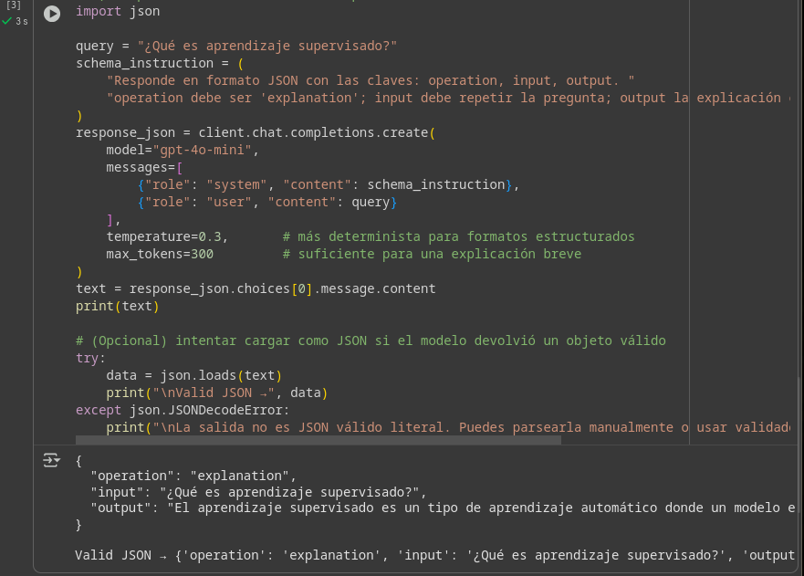
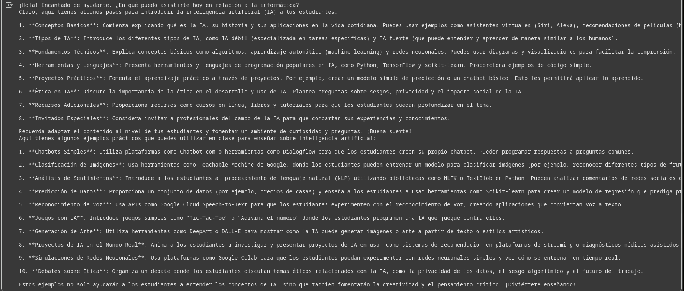

# Guías de Introducción a APIs de IA y LangChain con OpenAI

Este repositorio contiene dos notebooks educativos orientados al aprendizaje práctico del uso de **APIs de Inteligencia Artificial** y la **implementación de agentes con LangChain y OpenAI**.  
Su propósito es servir como material de estudio y práctica para estudiantes y profesionales interesados en la integración de IA generativa en proyectos Python.

---

## Contenido del Repositorio

### 1. `Guia3_IntroAPIsAI_Notebook.ipynb`
Esta guía presenta los conceptos fundamentales sobre cómo utilizar APIs de Inteligencia Artificial.  
Incluye ejemplos de uso con modelos de lenguaje y visión, explicación de autenticación mediante tokens y demostraciones de peticiones a endpoints de OpenAI.

**Temas tratados:**
- Introducción a las APIs de IA  
- Concepto de clave API y configuración del entorno  
- Uso básico de la API de OpenAI  
- Ejemplos de generación de texto  
- Buenas prácticas y control de costos  

---

### 2. `Guia4_LangChain_OpenAI.ipynb`
Esta segunda guía se centra en **LangChain**, una de las bibliotecas más potentes para la construcción de aplicaciones con modelos de lenguaje (LLMs).  
Muestra cómo conectar OpenAI a LangChain y crear agentes inteligentes paso a paso.

**Temas tratados:**
- ¿Qué es LangChain y para qué sirve?  
- Integración de LangChain con OpenAI  
- Cadenas, agentes y herramientas  
- Creación de un asistente conversacional básico  
- Ejemplos prácticos con prompts dinámicos  

---

## ⚙️ Requisitos Previos

Asegúrate de tener instalado **Python 3.10 o superior** y las siguientes librerías:

```bash
pip install openai langchain jupyter notebook python-dotenv
```

También necesitarás una **clave de API de OpenAI**, que puedes obtener en:  
[https://platform.openai.com/account/api-keys](https://platform.openai.com/account/api-keys)

Guárdala en un archivo `.env` con el siguiente formato:

```
OPENAI_API_KEY=tu_clave_aqui
```

---

## ▶️ Ejecución de las Guías

1. Clona este repositorio:
   ```bash
   git clone https://github.com/tu_usuario/guia-apis-ia.git
   cd guia-apis-ia
   ```

2. Abre Jupyter Notebook:
   ```bash
   jupyter notebook
   ```

3. Ejecuta los notebooks en orden:
   - `Guia3_IntroAPIsAI_Notebook.ipynb`
   - `Guia4_LangChain_OpenAI.ipynb`

4. Sigue las instrucciones paso a paso y ejecuta las celdas.

---

## Objetivos de Aprendizaje

- Comprender el funcionamiento de las APIs de IA.  
- Aprender a realizar peticiones a la API de OpenAI.  
- Conocer los principios básicos de LangChain.  
- Crear flujos inteligentes de conversación con modelos de lenguaje.  

---

## Estructura del Proyecto

```
├── Guia3_IntroAPIsAI_Notebook.ipynb
├── Guia_LangChain_OpenAI.ipynb
└── README.md
```

---

## Autor

**David Espinosa**  

---

## Evidencias



---

## 📚 Referencias

- [OpenAI API Documentation](https://platform.openai.com/docs)
- [LangChain Official Docs](https://python.langchain.com)
- [Python dotenv](https://pypi.org/project/python-dotenv/)
- [Jupyter Project](https://jupyter.org/)

---
